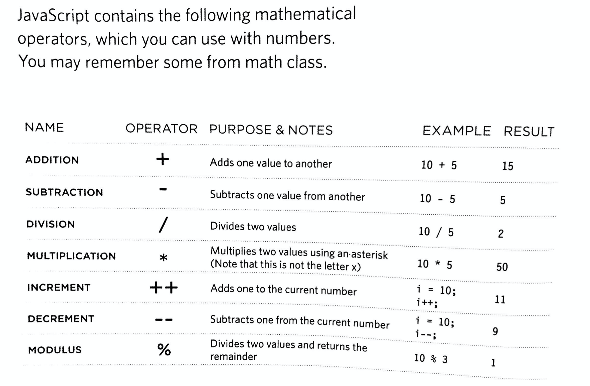

## Programming with JavaScript
This page is about all that I learned in the three sections that were assigned.  Intro + Script will be discussed first, then Expressions + Operations, and finally functions.  

### Intro + Script (1-24)
JavaScript can makes webpages intereactive through various means, including buttons, functions, and loops.  Forms are covered in Ch.13.  Core concepts, like events and selective reloading, are covered in the first 9 chapters.  In Ch. 10 - 13, practical application topics such as debugging and sorting data are covered. 

WHat are Scripts?  "A series of instructions a computer can follow to achieve a goal" (Duckett 14).  To have a well-run script, the designer need to:
- define the goal
- design the script
- code each step

Writing a script involves steps.  See p.20-22 for examples. 

### Expressions + Operators (74-79)

Two types of expressions:
1. Expressions that asign a value to a variable
2. Expressions that use two or more values to return a single value

Expressions rely on operators, which allow programmers to create a single value from one or more values (Duckett, 75).   

Source: (Duckett, 75)

String operators are another variation.  
> var cost1 = '7';
  var cost2 = '9';
  var total = cost1 + cost 2;

The result is 79 and not 16.  

### Functions (88-94) 

Functions must first be declared and then called in order to be performed.  

declared:
> function sayHello(){
  document.write('Hello!');
  }

called:
`sayHello();`

Functions can also have `parameters` like width and height.

example: 
> function getArea(width, height){
  return width * height;
  }

To use such a function, the programmer needs to enter the correct __arguments__.  For example, to use the above function, the programmer would need to enter `getArea(3,5)`.  Alternatively, the programmer could set arguments as variables:

> wallWidth = 3;
  wallHeight = 5;
  getArea (wallWidth, wallHeight);

Notice how the WallWidth variable and the WallHeight variable replaced the width, height variable in the original function.  

Programmers can get a single value out of a function: 
> function calculateArea(width, height){
  var area = width * height;
  return area;
  }
  var wallOne = calculateArea (3, 5);
  var wallTwo = calculateArea (8, 5);

This code will retrun **wallOne** to equal 15 and **wallTwo** to equal 40.  The function is called twice.  

Notice how the `{}` capture the function and the `;` indicate the next line of code. 